# my_api
API project with Slim FW

## Tools
- [composer](https://getcomposer.org/)
- [slim fw](https://www.slimframework.com/)
- [xampp](https://www.apachefriends.org/pt_br/index.html)
- [illuminate database](https://github.com/illuminate/database)
- [laravel](https://laravel.com/docs/11.x/readme)
- [CORS](https://developer.mozilla.org/en-US/docs/Web/HTTP/Headers/Access-Control-Allow-Origin)  
- [slim | enable-cors](https://www.slimframework.com/docs/v3/cookbook/enable-cors.html)  
- [firebase token](https://github.com/firebase/php-jwt)  
- [secret key generator](http://nux.net/secret)  
- [jwt-auth](https://github.com/tuupola/slim-jwt-auth)  

## Iniciando projeto
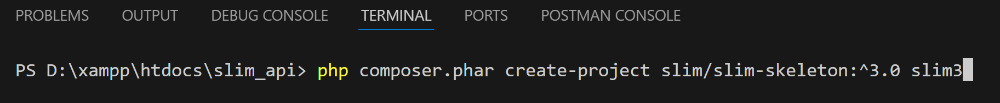  
Para versão mais recente, use a flag --prefer-dist  
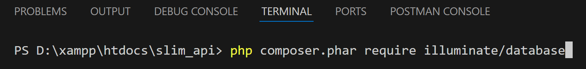

## Permissões de diretórios
Garanta permissão total a pasta logs do app!

## Database
Criando e populando tabelas
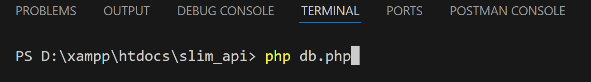  
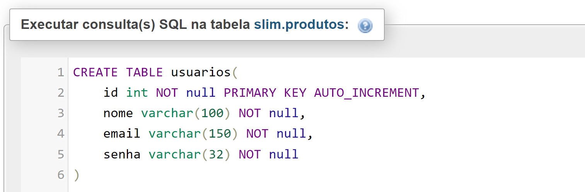  
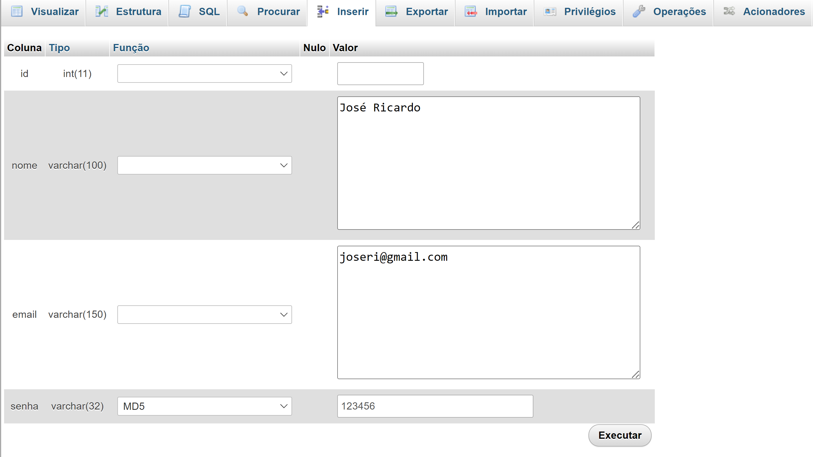

## Atualizando Dependencias
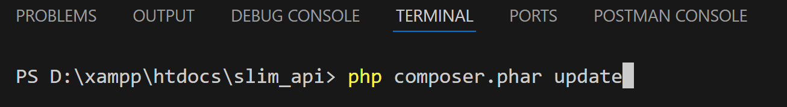

## Postman
### GET  
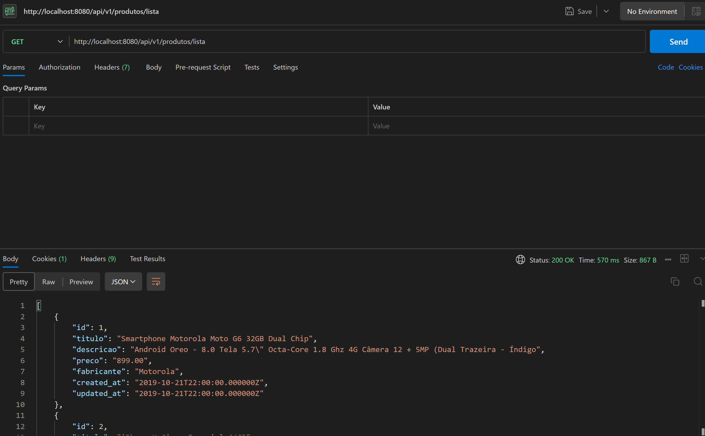  
### POST  
Defina os campos válidos para recebimento de dados no Model  
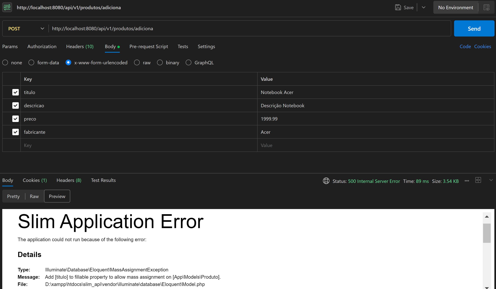  
  
### PUT  
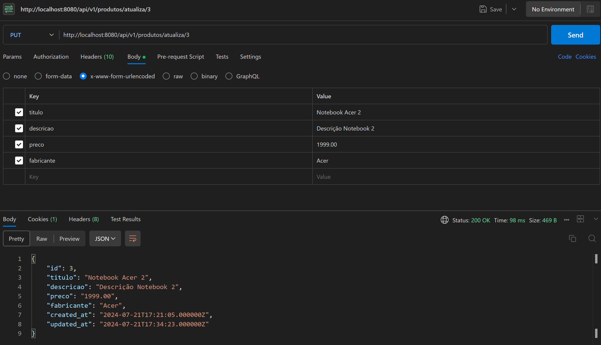  

### /api/token  
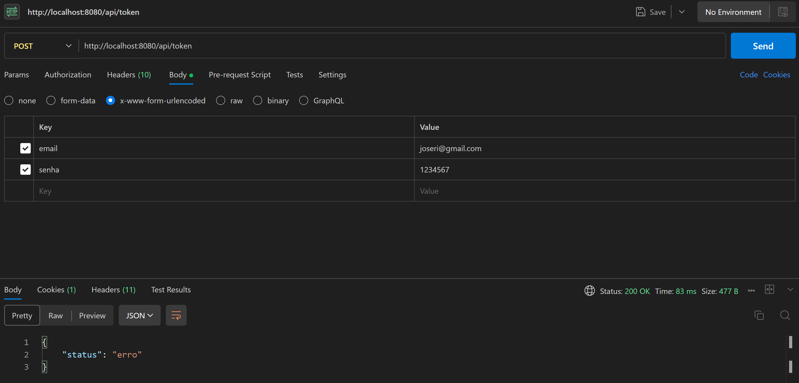  
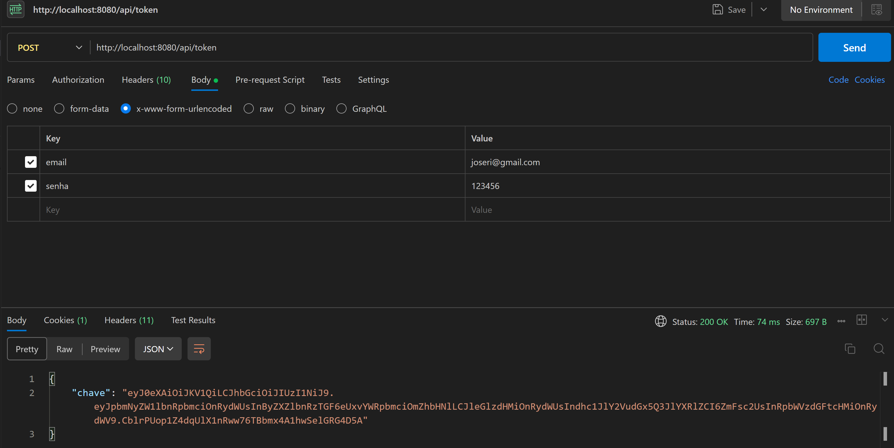  

### Acesso restrito e com X-Token (Autorization) header | Chave token
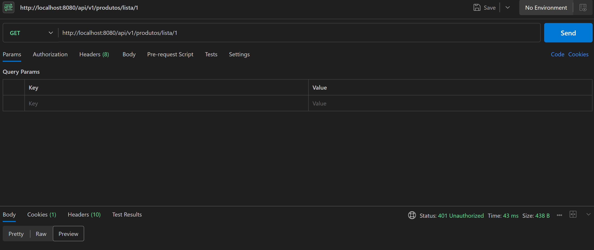  
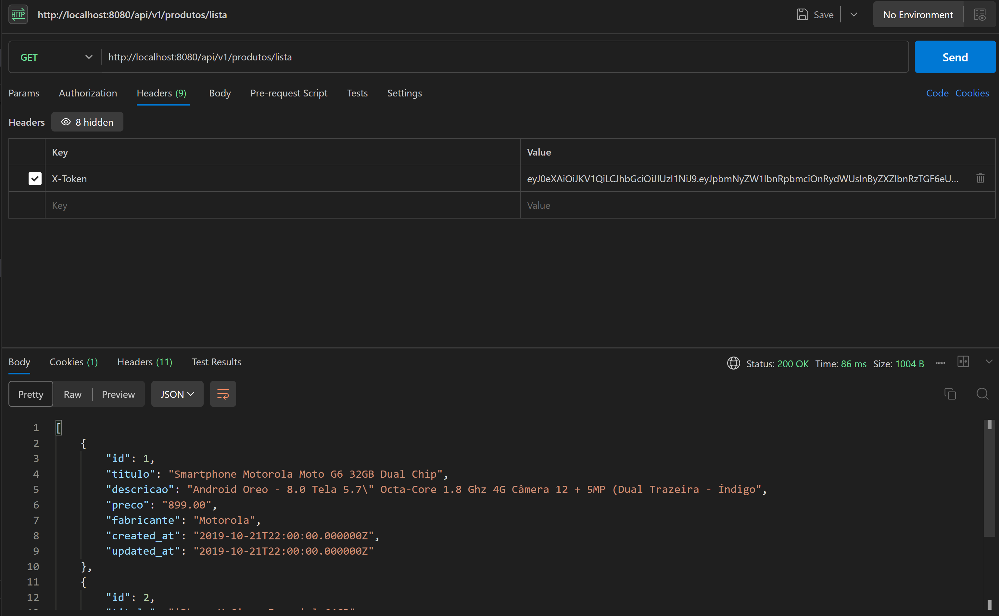

## Firebase PHP-JWT
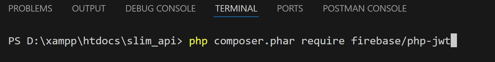

## JWT-Auth
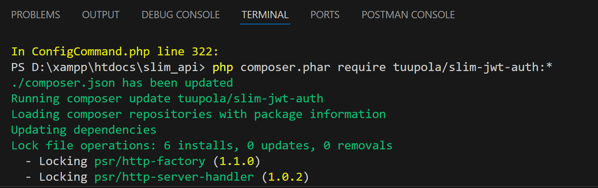

### Problemas com versões
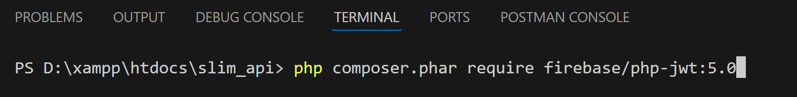