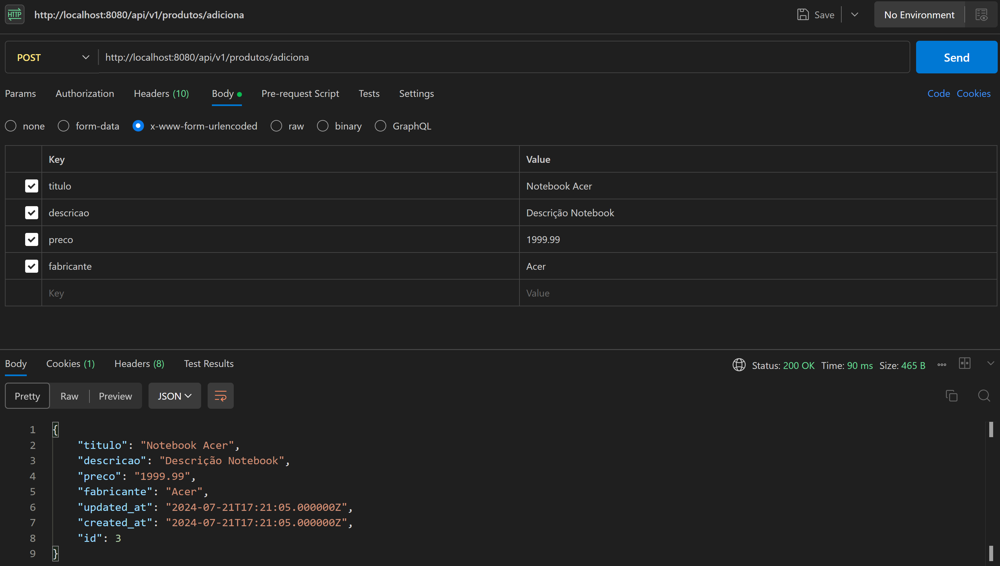

# my_api
API project with Slim FW

## Tools
- [composer](https://getcomposer.org/)
- [slim fw](https://www.slimframework.com/)
- [xampp](https://www.apachefriends.org/pt_br/index.html)
- [illuminate database](https://github.com/illuminate/database)
- [laravel](https://laravel.com/docs/11.x/readme)

## Iniciando projeto
  
Para versão mais recente, use a flag --prefer-dist  

## Permissões de diretórios
Garanta permissão total a pasta logs do app!

## Database
Criando e populando tabelas

## Atualizando Dependencias

## Postman
- GET  
  
- POST  
Defina os campos válidos para recebimento de dados no Model  
  
  